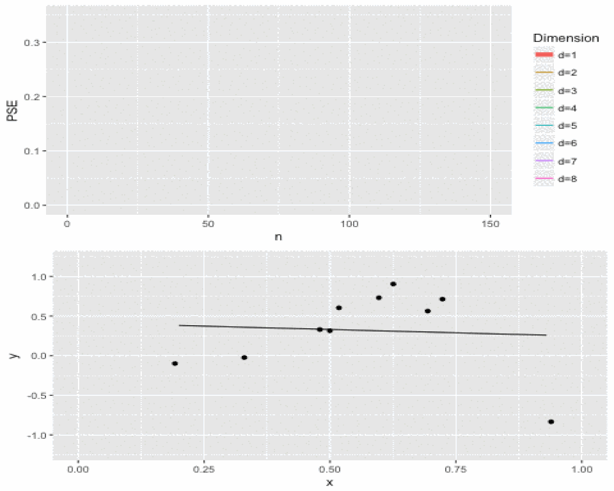

Sieves
========================================================
author: Nate Josephs, Matthew Wiens, Ben Draves 
date: 12/7/27
autosize: true
width: 1920
height: 1080

Intro
========================================================
incremental: true

**Goal**
- 2 random variables $X$ & $Y$ with $Y = f(X)$
- Estimate $f$

**Idea**
- Limit the class of functions we search over
- Let $n$ determine the complexity of the function space

**Kernel Analogy**
- Basis function is our kernel
- Complexity is our smoothing parameter
- Data-driven process for choosing complexity

Developing Sieves
========================================================
incremental: true

Function space
$$\mathcal{F}_n = \Big\{g(x): g(x) = \sum_{d=0}^{D}\alpha_d\phi_d(x)\Big\}$$
where $D\to\infty$ as $n\to\infty$

A series estimator is given by
$$ \hat{g}(x) = \sum_{d=0}^{D} \alpha_{d} \phi_{d}(x)$$

Two choices: $\phi_d$ \& $D$

**Basis functions**

- Fourier
- Gaussian
- splines
- wavelets

Focus on *polynomials* with fixed $D$, which leads to OLS estimates

**Complexity**

We will develop $d_{opt}$ after calculating bias, variance, and MISE

Developing Sieves
========================================================

**Bias**

**Variance**

**MISE**

Estimating the Dimension D
========================================================
incremental: true

One can show that
$$PSE\Big(\hat{f}(x^*)\Big) = Var(e^*) + MISE\Big(\hat{f}(x)\Big)$$

Therefore, $d_{opt}$ with respect to PSE will be the same as $d_{opt}$ with respect to MISE

If $\tilde{e} = Y^* - \hat{y}^*$, then
$$PSE\Big(\hat{f}(x^*)\Big) = E\big[\tilde{e}^2\big]$$
which is the expectation of a single leave-one-our squared prediction error

For each $i$, define $\tilde{e}_i = y_i - \hat{y_{(i)}}$ where $\hat{y_{(i)}}$ is fit on $X_1, \ldots, X_{i-1}, X_{i+1}, \ldots, X_n$

Then $PSE\Big(\hat{f_{(i)}}(x)\Big) = E\big[\tilde{e_i}^2\big]$ and we define the cross-validation (CV) criterion as
$$CV(\hat{f}) = \frac{1}{n}\sum_{i=1}^n \tilde{e}_i$$

**Properties**
- $E\Big[CV(\hat{f})\Big] = PSE\Big(\hat{f}(x^*)\Big)$
- asympotically equivalent to the $D$ chosen via $MISE$, Hansen (2012)

Simulation
========================================================
incremental: true

# 
Recall the model from HW5 given by
$$Y = \sin^3(2\pi X^3) + \epsilon$$
where
$$X \sim N(0, 1) \\ \epsilon \sim N(0, .2) \\$$

Our previous solution: LLR and Kernel Regression

**Sieves estimation simulation**
- $N = 150$ data points
- From $n = 10$ to $N$ in increments of $10$, we fit polynomial series estimator with degrees of complexity varying from $1$ to $8$
- Repeated this on $200$ separate datasets and plotted the PSE against $n$

Simulation - Results
========================================================

Application
========================================================

- *faithful*

We have seen many nonparametric solutions

**Sieves estimation**
- Fewer degrees of freedom!
- N = 32 to 272 by 10
- D = 1 to 12

Application - Results
========================================================

Conclusion
========================================================

**Summary**
- Developed series estimator
- Analyzed bias, variance, and MISE
- Derived data-driven process for choosing $d_{opt}$
- Simulated on $Y = \sin^3(2\pi X^3) + \epsilon$
- Applied on *faithful* data

**Further Exploration**
- Penalized sieve estimator as a way to control model complexity
- Testing with sieve estimators
- Infereneces about global properties of the mean function

Questions
========================================================

